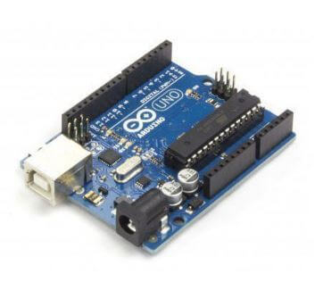
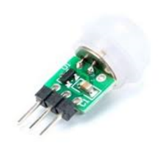
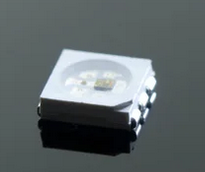
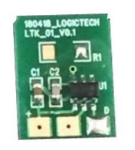
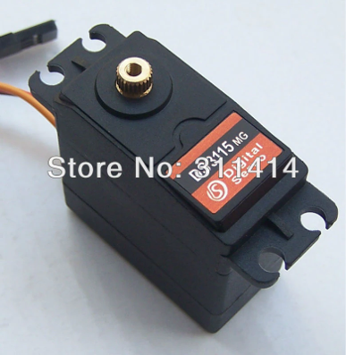
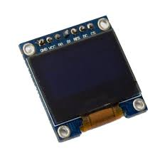
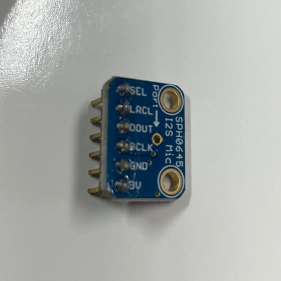
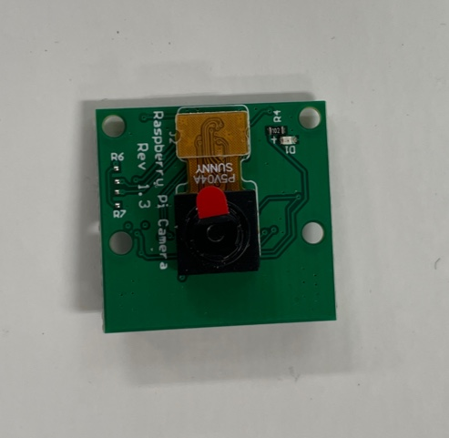

# Hardware

Details of the parts inside piBo.

- Atmega328p

   

   - It has no operating system of its own; it is programmed in C from an external program and the code is uploaded to the board.
   - It is mostly used to control external devices (sensors, LCDs, motors). In piBo it controls the PIR sensor, the Neopixels and the touch sensor.

- PIR Sensor

   

   - Infrared motion sensor
   - Detects moving objects that give off infrared.
   - Repeatable trigger mode  
      If an infrared change is detected within the delay time while the output is HIGH,  
      the delay time is reset and counting starts again while the output stays HIGH.  
      2 seconds after no person or infrared change is detected, the output goes LOW.

- Neopixel

   

   - LEDs with a built-in WS281x chip
   - Can be chained in any shape with simple wiring.
   - Every LED can be controlled individually from a single pin.

- Touch Sensor

   

   - Touching the pad under the PCB is detected as a touch
   - Mounted on the housing (3 mm thick or less).
   - Output is HIGH at power-on and LOW while touched

- Servo Motor

   

   - A servo motor that moves up to 180 degrees

- OLED

   

   - Shows data on the screen.
   - Uses the SSD1306 chip; there are SPI and I2C types depending on the interface.

- Microphone

   

   - Records sound.
   - A very small MEMS microphone using I2S.

- Camera

   

   - A camera compatible with the Raspberry Pi Camera v1.3.
   - Takes 5-megapixel pictures.
